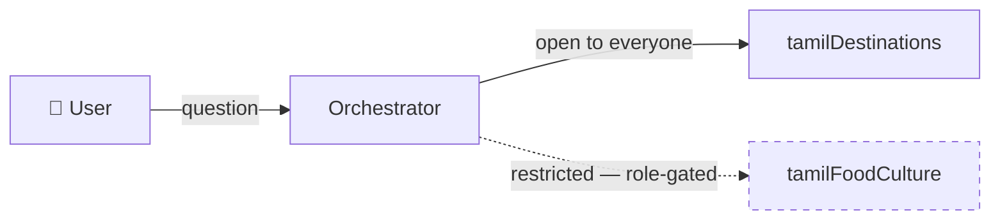
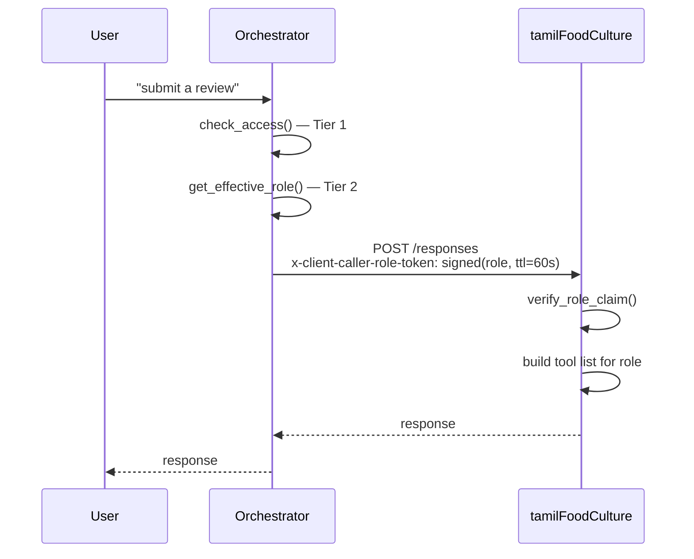

# Per-User RBAC in an Azure AI Foundry Multi-Agent System

An orchestrator agent that hands a question off to the right specialist,
and different users getting different access depending on who they
actually are — that was the whole ask. It sounds like it should be a
solved problem. It isn't, quite, and figuring out exactly where it stops
being solved is the interesting part of this story.

We built the system twice. The first version worked right up until the
moment we tested it with two different users instead of one, at which
point it quietly did the wrong thing — every user got every specialist's
answer, restricted or not, and nothing in the logs looked like an error.
The second version is the one running in production today, and it only
exists because we went and found out *exactly* why the first one failed,
instead of assuming a workaround would paper over it.

## The short version

| Question | Answer |
|---|---|
| Can an orchestrator restrict which *sub-agent* a user can reach? | **Yes.** Agent-level RBAC, live in production. |
| Can a sub-agent restrict which *tools* a caller can use inside it? | **Yes.** Tool-level RBAC, live in production. |
| Does the caller's identity survive a real A2A protocol call to the sub-agent? | **No.** Confirmed platform behavior, not a bug in our code. |
| So how does tool-level RBAC work at all, then? | The orchestrator resolves the caller's role itself against Azure RBAC, then hands the sub-agent a signed, short-lived claim over a **direct, non-A2A** call. |

> **Scope:** everything below is what we built, deployed, and tested
> ourselves against live Foundry agents. It doesn't cover Foundry's native
> `AgenticIdentityToken` / OAuth-passthrough connection mechanism — that's
> a separate, still-being-evaluated avenue, deliberately out of scope here.

## Contents

1. [What we set out to build](#what-we-set-out-to-build)
2. [Stack](#stack)
3. [Two building blocks: Agent Framework and A2A](#two-building-blocks-agent-framework-and-a2a)
4. [Round one: wire it all up over A2A](#round-one-wire-it-all-up-over-a2a)
5. [The quiet failure](#the-quiet-failure)
6. [Fixing the first problem: does this user get to ask at all?](#fixing-the-first-problem-does-this-user-get-to-ask-at-all)
7. [Wanting more: not just "can they ask," but "what can they do"](#wanting-more-not-just-can-they-ask-but-what-can-they-do)
8. [Five ways to smuggle an identity across a network hop, and why none of them worked](#five-ways-to-smuggle-an-identity-across-a-network-hop-and-why-none-of-them-worked)
9. [The fix: stop asking A2A to do something it won't](#the-fix-stop-asking-a2a-to-do-something-it-wont)
10. [What we'd tell someone about to build this](#what-wed-tell-someone-about-to-build-this)
11. [Where this still has sharp edges](#where-this-still-has-sharp-edges)
12. [Appendix A — RBAC grants](#appendix-a--required-azure-rbac-grants)
13. [Appendix B — verification commands](#appendix-b--verification-commands)
14. [References](#references)

---

## What we set out to build

A travel assistant, as a stand-in for the real thing: one orchestrator,
two specialists. `tamilDestinations` — temples, beaches, hill stations —
open to everyone. `tamilFoodCulture` — cuisine, festivals, culture —
treated as restricted, premium content. Two requirements, one nested
inside the other:

- Users without access to the food/culture project shouldn't get answers
  from it, even indirectly, even by going through the orchestrator.
- Among the users who *can* reach it, only some should be allowed to
  *write* new content — submit a review, say — not just read.

The requirement underneath both of those: the access decision had to come
from the user's **actual Azure RBAC role**, the same role-assignment data
Azure already tracks for everything else, not a second permission system
we'd have to invent and keep in sync by hand.



---

## Stack

| Layer | What we used |
|---|---|
| Agent hosting | Azure AI Foundry Agent Service — Hosted Agents, each a Docker container behind a Foundry-managed endpoint |
| Agent SDK | Microsoft Agent Framework (`agent_framework`) — `Agent`, `FoundryChatClient`, tools/skills |
| Server runtime | `azure-ai-agentserver-responses` / `-core` — `ResponsesAgentServerHost`, `ResponseContext`, `get_request_context()` |
| Agent-to-agent | A2A protocol — `a2a-sdk`, `agent_framework.a2a.A2AAgent`, `A2ACardResolver` |
| Access control | Azure RBAC via the ARM `roleAssignments` REST API — the single source of truth for every decision |
| Build & deploy | Docker + Azure Container Registry, `az` CLI + Foundry Agents REST API |
| Language | Python 3.11 |

*Reference: [Deploy a Hosted Agent — Microsoft Learn](https://learn.microsoft.com/en-us/azure/foundry/agents/how-to/deploy-hosted-agent)*

---

## Two building blocks: Agent Framework and A2A

Worth pausing on these before the story gets into what broke, since
everything downstream depends on understanding what each one actually is.

**Agent Framework**'s core idea is small: an `Agent` wraps a chat client —
`FoundryChatClient`, pointed at a model deployment — plus a list of Python
functions it can call as tools. Nothing exotic. What makes it useful for a
multi-agent system is `agent_framework.a2a`, which lets you wrap *another
agent's* A2A endpoint so it looks, from the calling agent's point of view,
like just one more tool: `A2AAgent(...).as_tool(...)`. The orchestrator's
LLM calls a specialist exactly the way it would call a local function —
it has no idea there's a network hop, a container boundary, and an
entirely separate identity involved.

**A2A** is the protocol that makes that hop possible. Foundry hosts every
agent behind a managed endpoint that can speak more than one protocol at
once: `responses` (plain request/response — every hosted agent supports
this) and, optionally, `a2a` — discovery and invocation through a
standard Agent Card. One Foundry-specific wrinkle worth knowing up front:
the card lives at `/agentCard/v1.0`, not the A2A spec's usual
`/.well-known/agent.json`. It cost us a debugging session the first time.

*References: [A2A Tool Guide](https://learn.microsoft.com/en-us/azure/foundry/agents/how-to/tools/agent-to-agent) · [Enable A2A Endpoint](https://learn.microsoft.com/en-us/azure/foundry/agents/how-to/enable-agent-to-agent-endpoint) · [A2A Protocol Spec](https://a2a-protocol.org/latest/) · [agent-framework](https://github.com/microsoft/agent-framework) · [a2a-sdk](https://github.com/google-a2a/a2a-python)*

---

## Round one: wire it all up over A2A

The plan was straightforward: deploy all three agents as Foundry Hosted
Agents, have the orchestrator fetch each specialist's Agent Card, and
register it as a tool it could call over the real A2A endpoint. Two
documented ways exist to do that registration. Both are broken.

```python
# Documented method 1
from azure.ai.projects.models import A2APreviewTool
tool = A2APreviewTool(project_connection_id=connection.id)

# Documented method 2 - same underlying bug
from agent_framework.foundry import FoundryChatClient
tool = FoundryChatClient.get_a2a_tool(project_connection_id=conn_id)
```

Both throw the same error, regardless of which one you pick:

```json
{
  "message": "Agent card path must target the same host, project, and agent as the server URL.",
  "type": "invalid_request_error",
  "code": "tool_user_error"
}
```

That's [GitHub #47419](https://github.com/Azure/azure-sdk-for-python/issues/47419) — open, `needs-team-attention`, still unresolved as of this writing.

What actually works is a level lower: `A2AAgent` directly, with a manual
auth interceptor supplying the bearer token yourself. From
`a2a/orchestrator/main.py:283-314`:

```python
async def build_a2a_agent(name, url, description, http_client):
    resolver = A2ACardResolver(
        httpx_client=http_client,
        base_url=url,
        agent_card_path="agentCard/v1.0",   # Foundry-specific, not .well-known
    )
    agent_card = await resolver.get_agent_card()
    a2a_agent = A2AAgent(
        name=agent_card.name,
        description=agent_card.description or description,
        agent_card=agent_card,
        url=url,
        http_client=http_client,   # pre-authenticated with a bearer token
    )
    await a2a_agent.__aenter__()
    return a2a_agent
```

That got real A2A communication working end to end — the orchestrator
correctly routed questions to both specialists by topic. Demo-ready. Also,
as it turned out, hiding the actual problem rather than solving it.

---

## The quiet failure

`http_client` in the snippet above is authenticated with **the
orchestrator's own managed identity token**. Not the user's. Every call
the orchestrator makes to a specialist happens as "the orchestrator,"
regardless of who's actually asking. Called directly, Azure RBAC still
works exactly as you'd expect:

| Test | Result |
|---|---|
| Direct call to `tamilDestinations` (public) | ✅ Passes |
| Direct call to `tamilFoodCulture` (restricted), unauthorized caller | ❌ `403` — correct |
| Same restricted question, same unauthorized caller, through the orchestrator | ✅ **Succeeds anyway** |

We confirmed it deliberately, not by accident: a VM with a managed
identity granted access to the public specialist's project and
*explicitly not* the restricted one. Direct calls behaved correctly.
Calls through the orchestrator didn't. We also went looking inside
`ResponseContext` for anything resembling the caller's real identity, on
the theory that maybe it was there and we just weren't reading it right:

```
context_attrs: ['client_headers', 'conversation_id', 'created_at',
                'get_history', 'get_input_items', 'get_input_text',
                'is_shutdown_requested', 'mode_flags', 'platform_context',
                'query_parameters', 'request', 'response_id']
context.isolation           -> does not exist
context.isolation.user_key  -> does not exist
context.request.headers     -> Authorization already stripped
```

It wasn't a reading problem. The platform genuinely wasn't handing it
over.

*References: [GitHub #45797 — Hosted Agent removes Authorization Header disabling OBO](https://github.com/Azure/azure-sdk-for-python/issues/45797) (open) · [Microsoft Q&A: User Identity Passthrough for Hosted Agents](https://learn.microsoft.com/en-us/answers/questions/5872669/user-identity-passthrough-for-hosted-agents-callin) — official: "For code-first Hosted Agents, OAuth flows are handled externally by the service layer... user tokens are not exposed within container runtime."*

---

## Fixing the first problem: does this user get to ask at all?

While chasing the above, we found the one piece of per-request identity
Foundry *does* hand over honestly: an `x-agent-user-id` header, surfaced
in code as `get_request_context().user_id`. We checked — it really is the
caller's Entra Object ID, not some opaque platform token — and it's
available the moment a real user's request lands on the orchestrator's
own endpoint. First hop, solved, for free.

That's enough to build real agent-level RBAC: before the orchestrator
even constructs the LLM's tool list, it checks whether this specific
caller has any role on a given specialist's project. From
`a2a/orchestrator/main.py:104-142`:

```python
async def check_access(credential, principal_id: str | None, project_name: str) -> bool:
    if not principal_id:
        return False  # fail closed - no identity, no access
    token = credential.get_token("https://management.azure.com/.default").token
    headers = {"Authorization": f"Bearer {token}"}
    async with httpx.AsyncClient(timeout=httpx.Timeout(30.0)) as client:
        for scope in _scope_chain(project_name):  # project -> account -> subscription
            resp = await client.get(
                f"{ARM_BASE}{scope}/providers/Microsoft.Authorization/roleAssignments",
                headers=headers,
                params={"api-version": "2022-04-01", "$filter": f"principalId eq '{principal_id}'"},
            )
            resp.raise_for_status()
            for a in resp.json().get("value", []):
                if a["properties"]["scope"].lower() == scope.lower():
                    return True
    return False
```

*Reference: [ARM Role Assignments — List REST API](https://learn.microsoft.com/en-us/rest/api/authorization/role-assignments/list-for-scope)*

Wired into `build_agent_for_caller()` (`main.py:321-376`): if the check
passes, the caller gets a real tool — fetch the agent card, make the real
A2A call. If it doesn't, they get a **dummy tool**, same name, same
description, that returns `ACCESS_DENIED: ...` immediately with no
network call at all (`create_dummy_tool()`, `main.py:207-217`). The system
prompt tells the LLM to relay that denial exactly as given, never to
paper over it with a guess.

> **The one real bug in this part, and it's a sneaky one.** Azure's
> role-assignment list API, queried at some scope `S`, returns matches
> **at S and everything below it** by default — not only exact matches at
> `S`. We walk *up* the ancestor chain (project → account → subscription)
> deliberately, to catch broader inherited grants — but that means a naive
> "any result came back = allowed" check can be fooled by a grant that
> only exists on a completely unrelated **sibling** project under the same
> account. The fix is the exact-match comparison in the snippet above:
> only count a result whose own `properties.scope` is identical to the
> scope you actually queried.

That alone is a complete, working answer to "can this caller reach this
sub-agent at all" — enforced before any sub-agent code runs.

---

## Wanting more: not just "can they ask," but "what can they do"

Agent-level access is a single switch: on or off. We wanted a dial.
Within one sub-agent, some callers should get read-only tools, others
read *and* write. That means the caller's identity — or at least a
permission decision already made about them — has to make it **into the
sub-agent's own container code**. Which sounds like a small step up from
what we'd just solved. It isn't. `x-agent-user-id` solves the first hop —
user to orchestrator. This is the *second* hop — orchestrator to
sub-agent — and nothing says the platform treats those the same way.

It doesn't. We tested it directly: called the orchestrator as ourselves,
had it call a specialist over real A2A using its own separate managed
identity, and looked at what the specialist's container actually
received. Only ever the orchestrator's identity. Never ours. We left the
debug tooling that proved this in the code — it's still there today
(`a2a/specialist1/main.py:69-106`):

```python
if user_input.strip().lower() == "checkheaders":
    return TextResponse(context, request,
        text=f"client_headers={context.client_headers!r} "
             f"x-client-user-id={context.client_headers.get('x-client-user-id')!r}")

if user_input.strip().lower() == "checkbaggage":
    return TextResponse(context, request, text=f"baggage={dict(otel_baggage.get_all())!r}")

if user_input.strip().lower() == "checkrawheaders":
    return TextResponse(context, request, text=f"raw_headers={_raw_headers_var.get()!r}")
```

The orchestrator's own `checkbaggage` debug command (`main.py:401-422`)
tells the same story from the other end — it calls a specialist over A2A
and reports both the real caller's `user_id` and whatever the specialist
says it received. The two never matched.

---

## Five ways to smuggle an identity across a network hop, and why none of them worked

At this point the question stopped being "can we find the identity" and
became "is there *any* channel across an A2A call that isn't being
scrubbed." We went through everything we could think of, tested live
against real deployed agents rather than reasoned about in the abstract:

| Channel tried | Result | What we actually saw |
|---|---|---|
| Custom `x-client-*` HTTP header | ❌ Arrives empty | The client SDK does put it on the wire correctly — confirmed by reading `agent_framework_a2a`/`a2a-sdk` source. The loss happens server-side. |
| OpenTelemetry `baggage` header | ⚠️ Survives, but gets replaced | Our own `caller-user-id` value never showed up on the other end — only Foundry's own baggage keys did. |
| A2A `Message.metadata` | ❌ Overwritten entirely | Sent `{"caller_user_id": ...}`; got back Foundry's own `{'protocol': 'a2a', 'a2a_context_id': ..., ...}` with our keys gone. |
| A2A structured `Part.data` | ❌ Rejected outright | `ContentTypeNotSupportedError` — the agent card only declares a `text` input mode. |
| `context.isolation` / `.user_key` | ❌ Doesn't exist | Confirmed by direct attribute inspection, not just absence from the docs. |
| Plain text message content | ✅ The only thing that reliably survives | Everything that actually works in this system routes through this. |

We didn't stop at "it doesn't work" — we wanted the actual mechanism,
because "it's stripped somewhere" isn't something you can design around.
So we added a temporary debug middleware to a test sub-agent
(`a2a/specialist1/main.py:22-38`, `RawHeaderCaptureMiddleware`) that dumps
every raw header the container process receives, bypassing the SDK's own
narrow filtering entirely. That's how we found there are **two separate
strip points**, not one:

1. An **ingress reverse proxy** allowlists a fixed set of Foundry's own
   headers, plus anything prefixed `x-client-`. Anything else, any name,
   never reaches the container — true for direct calls and A2A calls
   alike.
2. An **A2A-specific step, deeper in**: even `x-client-*` headers, which
   survive the proxy on both paths, still arrive empty specifically on
   the A2A path. Foundry's A2A-to-Responses bridge builds a brand-new
   internal request to actually invoke the sub-agent's handler for that
   hop, and that reconstruction simply doesn't carry custom headers
   forward.

We checked whether a newer SDK closed this gap — installed the newest
available alpha at the time (`agent-framework-foundry-hosting`
1.0.0a260630) and read its source directly. Same underlying primitives.
No change.

*Corroborating references: [Agent Identity Concepts](https://learn.microsoft.com/en-us/azure/foundry/agents/concepts/agent-identity) — defines Attended/OBO vs. Unattended modes; hosted agents run Unattended · [Securing a Multi-Agent AI Solution: the Complexities of OBO — Microsoft Tech Community](https://techcommunity.microsoft.com/blog/azurearchitectureblog/securing-a-multi-agent-ai-solution-focused-on-user-context--the-complexities-of-/4493308) · ["Authorization Propagation in Multi-Agent AI Systems," arXiv:2605.05440](https://arxiv.org/pdf/2605.05440) — "RBAC cannot express 'this agent may access this dataset only when acting on behalf of a specific user within a specific workflow.'" · [a2aproject/A2A#19 — Delegated User Authorization for Agent2Agent Servers](https://github.com/a2aproject/A2A/issues/19), open at the protocol level*

---

## The fix: stop asking A2A to do something it won't

Once the root cause was two concrete strip points instead of a vague "it
doesn't work," the fix stopped being a mystery. A2A's Agent Card is still
genuinely useful for *discovery* — name, description, skills, all served
correctly. But for the one specialist that needs tool-level RBAC, we
don't invoke it over A2A at all. We call its plain **Responses-protocol
endpoint directly**, and a custom header sent straight there arrives
completely intact — no bridge, no reconstruction, nothing in the way.

Concretely: `tamilFoodCulture`'s project name, agent name, and Responses
URL are just hardcoded constants in the orchestrator, since we already
know them statically. No A2A discovery, no A2A invocation, for this one
hop. (`tamilDestinations` still goes through real A2A — it doesn't need
tool-level RBAC, so there's no reason to give it up.)



### Resolving *which* role the caller has

Not just "any access," but specifically Reader or Contributor. From
`a2a/orchestrator/main.py:163-204`, `get_effective_role()`:

```python
_BUILTIN_ROLE_GUIDS = {
    "acdd72a7-3385-48ef-bd42-f606fba81ae7": "Reader",
    "b24988ac-6180-42a0-ab88-20f7382dd24c": "Contributor",
}
ROLE_PRECEDENCE = ["Contributor", "Reader"]
```

*Reference: [Azure built-in roles — Reader](https://learn.microsoft.com/en-us/azure/role-based-access-control/built-in-roles/general#reader) · [Contributor](https://learn.microsoft.com/en-us/azure/role-based-access-control/built-in-roles/general#contributor) — the GUIDs are fixed and identical in every Azure tenant.*

> **A second bug, in the same neighborhood as the first.** We originally
> resolved the human-readable role name with a live
> `GET .../roleDefinitions/{guid}` call. It silently failed and always
> returned `None` — role *definitions* live at the subscription level, not
> nested under the Cognitive Services account, so the orchestrator's
> account-scoped `Reader` grant (plenty for reading role *assignments*)
> doesn't cover reading role *definitions*. The fix was to stop making
> that call at all — Azure's built-in role GUIDs don't change, so a
> hardcoded map removes both the extra network round-trip and the extra
> permission requirement.

### Handing the role to the sub-agent without letting anyone forge it

A plain header would work functionally, right up until someone who can
reach the sub-agent's Responses endpoint directly — bypassing the
orchestrator entirely — just sets it themselves and grants their own
write access. So instead of a plain header, the orchestrator signs the
claim, short TTL, HMAC (`a2a/orchestrator/role_token.py:31-47`,
`sign_role_claim()`):

```python
def sign_role_claim(role, principal_id, ttl_seconds=60) -> str:
    if not _SECRET:
        return ""  # fail closed - unsigned claims are never trusted
    payload = {"role": role or "none", "principal_id": principal_id or "", "exp": int(time.time()) + ttl_seconds}
    payload_b64 = _b64url_encode(json.dumps(payload, separators=(",", ":")).encode("utf-8"))
    sig = hmac.new(_SECRET.encode("utf-8"), payload_b64.encode("ascii"), hashlib.sha256).hexdigest()
    return f"{payload_b64}.{sig}"
```

*Reference: [RFC 2104 — HMAC: Keyed-Hashing for Message Authentication](https://www.rfc-editor.org/rfc/rfc2104)*

It travels as `x-client-caller-role-token` on the direct POST
(`main.py:244-260`, `call_food_culture_direct()`).

### The sub-agent side: verify, then build only the tools this role gets

`a2a/specialist2/main.py`:

```python
def get_allowed_tool_names(role: str) -> list[str]:
    if role == "Contributor":
        return ["read_food_info", "write_food_review"]
    return ["read_food_info"]          # unknown/missing role fails closed

@app.response_handler
async def handler(request, context, _cancellation_signal):
    role_token = context.client_headers.get("x-client-caller-role-token")
    role, signed_principal_id = verify_role_claim(role_token)   # role_token.py
    ...
    tools = [_ALL_TOOLS[name] for name in get_allowed_tool_names(role)]
    agent = Agent(client=client, name="TamilFoodCultureSpecialist", instructions=INSTRUCTIONS, tools=tools)
```

For a Reader — or anyone with a missing or forged token — `write_food_review`
isn't in the tool list at all. Not offered and then blocked. Genuinely not
there for the LLM to even consider.

We tested it the way you'd want to be shown, not just told: granted a
test principal `Contributor` on the restricted project, confirmed
`checkrole` reported it correctly, then sent a real conversational request
— "tell me about jigarthanda, and submit a review saying it's delicious"
— and watched it use both `read_food_info` and `write_food_review` in the
same turn.

---

## What we'd tell someone about to build this

- **Agent-level RBAC works, cleanly.** The real caller's identity arrives
  honestly on the first hop (`x-agent-user-id`), checked against live
  Azure RBAC, enforced by swapping in a dummy tool before the LLM ever
  gets involved.
- **Tool-level RBAC also works — but only once you stop expecting A2A to
  carry it.** Identity and permission data don't survive Foundry's A2A
  bridge, through any channel we could find, and multiple official
  Microsoft Q&A threads confirm this is deliberate platform behavior, not
  something specific to our deployment.
- **The permission decision has to be made once, up front, by something
  that already has the full picture** — here, the orchestrator, using
  Azure RBAC as ground truth — and then handed downstream as a signed
  claim over a plain, non-A2A call. The sub-agent doesn't need to
  understand RBAC at all. It just verifies a signature and builds a tool
  list.
- **Be honest with yourself about what security model this actually is.**
  This is self-enforced authorization, not delegated authorization. The
  orchestrator still does the real work under its own identity; it simply
  refuses to act until it's separately convinced the real caller is
  allowed to ask. That's enough to gate access correctly. It is not the
  same guarantee as a sub-agent independently validating a genuine
  per-user token.

---

## Where this still has sharp edges

- **Role scope conflation.** `get_effective_role()` currently resolves
  against the restricted project's own scope — so a `Contributor` grant
  given purely for infrastructure-management reasons on that project
  would *also* unlock the write tool. The cleaner fix, not yet built:
  resolve against a separate, otherwise-unused "marker" resource instead,
  so infra access and app-data access are provably different grants.
- **Direct role assignments only.** A caller whose access comes solely
  from Entra group membership won't be detected by either check.
- **No revocation propagation.** The per-caller tool set is cached for the
  life of the container process — a mid-session revocation doesn't take
  effect until a fresh process picks up the next request.
- **Bypassing the orchestrator fails closed, which is the point.** A
  caller who hits the sub-agent's Responses endpoint directly, with no
  valid signed token, gets read-only. There's nothing to forge — the
  token is signed by code they don't control.
- **A simpler alternative exists, and we validated it without adopting
  it:** deploy two static copies of the same image, each with a different
  `AGENT_ROLE` environment variable, and have the orchestrator pick which
  URL to call. This is an officially supported Foundry pattern, and it
  sidesteps the entire "does data survive the hop" question by never
  asking it — at the cost of doubling compute per permission tier, which
  stops being appealing past two or three tiers.

---

## Appendix A — Required Azure RBAC grants

**Orchestrator's own managed identity:**
```bash
# Data-plane access to every project it may proxy to
az role assignment create --role "Cognitive Services User" \
  --assignee-object-id "<orchestrator-principal-id>" --assignee-principal-type ServicePrincipal \
  --scope "/subscriptions/<sub>/resourceGroups/<rg>/providers/Microsoft.CognitiveServices/accounts/<account>/projects/<ProjectName>"

# Read access to list OTHER users' role assignments (needed for the prehook)
az role assignment create --role "Reader" \
  --assignee-object-id "<orchestrator-principal-id>" --assignee-principal-type ServicePrincipal \
  --scope "/subscriptions/<sub>/resourceGroups/<rg>/providers/Microsoft.CognitiveServices/accounts/<account>"
```

**Each real end user**, on the restricted sub-agent's project:
- Tier 1 (can reach it at all): any role assignment there.
- Tier 2 (which tools): specifically `Reader` or `Contributor`.

```bash
az role assignment create --role "Reader" \
  --assignee-object-id "<user-object-id>" --assignee-principal-type User \
  --scope "/subscriptions/<sub>/resourceGroups/<rg>/providers/Microsoft.CognitiveServices/accounts/<account>/projects/<SubAgentProject>"
```

---

## Appendix B — Verification commands

```bash
TOKEN=$(az account get-access-token --resource https://ai.azure.com --query accessToken -o tsv)
BASE="https://<account>.services.ai.azure.com/api/projects/<AgentFrameworkProject>"

# 1. Confirm the orchestrator sees the real caller identity
curl -s -X POST "$BASE/agents/travelOrchestrator/endpoint/protocols/openai/responses?api-version=v1" \
  -H "Authorization: Bearer $TOKEN" -H "Content-Type: application/json" \
  -d '{"input": "whoami", "store": false}'

# 2. Tier 1 - agent-level reachability
curl -s -X POST "$BASE/agents/travelOrchestrator/endpoint/protocols/openai/responses?api-version=v1" \
  -H "Authorization: Bearer $TOKEN" -H "Content-Type: application/json" \
  -d '{"input": "checkaccess", "store": false}'

# 3. Tier 2 - which role, bypassing the LLM entirely
curl -s -X POST "$BASE/agents/travelOrchestrator/endpoint/protocols/openai/responses?api-version=v1" \
  -H "Authorization: Bearer $TOKEN" -H "Content-Type: application/json" \
  -d '{"input": "checkrole", "store": false}'

# 4. Does identity survive A2A to a sub-agent's own container?
curl -s -X POST "$BASE/agents/travelOrchestrator/endpoint/protocols/openai/responses?api-version=v1" \
  -H "Authorization: Bearer $TOKEN" -H "Content-Type: application/json" \
  -d '{"input": "checkbaggage", "store": false}'
```

---

## References

**Microsoft Learn**
1. [Deploy a Hosted Agent](https://learn.microsoft.com/en-us/azure/foundry/agents/how-to/deploy-hosted-agent)
2. [Enable A2A Endpoint](https://learn.microsoft.com/en-us/azure/foundry/agents/how-to/enable-agent-to-agent-endpoint)
3. [A2A Tool Guide](https://learn.microsoft.com/en-us/azure/foundry/agents/how-to/tools/agent-to-agent)
4. [Agent Identity Concepts](https://learn.microsoft.com/en-us/azure/foundry/agents/concepts/agent-identity)
5. [MCP Authentication](https://learn.microsoft.com/en-us/azure/foundry/agents/how-to/mcp-authentication)
6. [ARM Role Assignments — List REST API](https://learn.microsoft.com/en-us/rest/api/authorization/role-assignments/list-for-scope)
7. [Azure built-in roles reference](https://learn.microsoft.com/en-us/azure/role-based-access-control/built-in-roles/general)

**Microsoft Q&A**

8. [User Identity Passthrough for Hosted Agents Calling a Custom MCP Server](https://learn.microsoft.com/en-us/answers/questions/5872669/user-identity-passthrough-for-hosted-agents-callin)

**GitHub issues**

9. [Azure/azure-sdk-for-python#47419](https://github.com/Azure/azure-sdk-for-python/issues/47419) — A2APreviewTool "Agent card path" error (open)
10. [Azure/azure-sdk-for-python#45797](https://github.com/Azure/azure-sdk-for-python/issues/45797) — Hosted Agent removes Authorization Header disabling OBO (open)
11. [Azure/azure-sdk-for-python#47474](https://github.com/Azure/azure-sdk-for-python/issues/47474) — Error messages masked as "internal server error"
12. [a2aproject/A2A#19](https://github.com/a2aproject/A2A/issues/19) — Delegated User Authorization for Agent2Agent Servers (open, protocol-level gap)

**SDK / protocol**

13. [agent-framework repository](https://github.com/microsoft/agent-framework)
14. [a2a-sdk (Python) repository](https://github.com/google-a2a/a2a-python)
15. [A2A Protocol Specification](https://a2a-protocol.org/latest/)
16. [W3C Baggage specification](https://www.w3.org/TR/baggage/)
17. [RFC 2104 — HMAC](https://www.rfc-editor.org/rfc/rfc2104)

**Industry / academic**

18. ["Authorization Propagation in Multi-Agent AI Systems," arXiv:2605.05440](https://arxiv.org/pdf/2605.05440)
19. [Securing a Multi-Agent AI Solution: the Complexities of OBO — Microsoft Tech Community](https://techcommunity.microsoft.com/blog/azurearchitectureblog/securing-a-multi-agent-ai-solution-focused-on-user-context--the-complexities-of-/4493308)

**Code, cited throughout (this repository)**

20. `orchestrator/main.py`, `orchestrator/role_token.py`
21. `specialist1/main.py`, `specialist2/main.py`, `specialist2/role_token.py`
