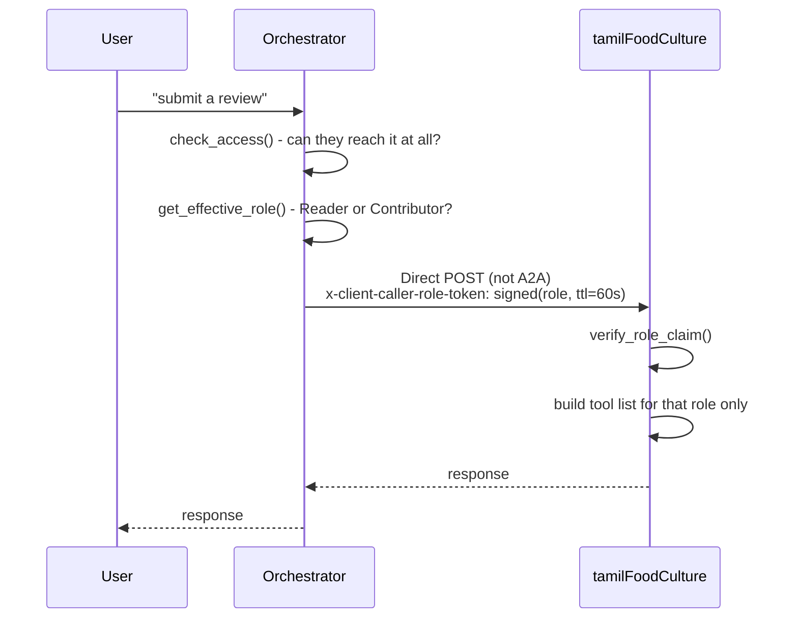

# Per-User RBAC in an Azure AI Foundry Multi-Agent System

## Introduction

Imagine a helpful assistant that answers your questions by quietly
forwarding them to the right expert behind the scenes. You ask about
temples in Tamil Nadu, it asks a "travel expert" agent. You ask about
local food, it asks a "food and culture" agent. You never see the
handoff — you just get an answer.

Now add one more requirement: some of those expert agents hold
information that not everyone should get. Maybe it's premium content.
Maybe it's internal-only data. Whatever the reason, we wanted the
assistant to check — automatically, using the same permission system
Azure already uses everywhere else — whether the person asking is
actually allowed to get that answer, before it ever asks the expert.

That sounds like it should be a small feature. It turned into a real
investigation, with several dead ends that looked like bugs in our code
but turned out to be the platform behaving exactly as designed — just not
in the way we assumed. This is that story, written so that no prior
knowledge of Azure or AI agents is required to follow it. The technical
details — code, exact commands, links to sources — are collected at the
end for anyone who wants them.

---

## The Setup

A few terms, explained simply, since they come up constantly:

- **The orchestrator** — the "front desk" agent. It's the one thing users
  actually talk to. It listens to a question, decides which expert can
  answer it, and relays the answer back.
- **A sub-agent** (or "specialist") — one of the expert agents behind the
  orchestrator. Each one knows about a specific topic.
- **RBAC (Role-Based Access Control)** — Azure's standard way of saying
  "this person is allowed to do this thing, in this place." Instead of
  keeping our own private list of who can do what, we wanted to just ask
  Azure the same question Azure already answers for everything else:
  "does this person have a role here?"
- **A2A (Agent-to-Agent) protocol** — the specific technical method the
  orchestrator uses to actually call a sub-agent over the network. Think
  of it as the phone line between the front desk and the expert's office.

Our test project: a travel assistant with two experts. One,
`tamilDestinations`, covers temples, beaches, and hill stations, and is
open to everyone. The other, `tamilFoodCulture`, covers food and culture,
and was meant to be restricted — only certain people should get answers
from it, and among those people, only some should be allowed to *add*
new information (like submitting a review), not just read it.

---

## Chapter 1 — What We Set Out to Build

The goal, in one sentence: **let Azure's own permission records decide who
gets which answers, automatically, without us keeping a separate list.**

Specifically, two layers of restriction:

1. **Can this person reach this expert at all?** Someone without access to
   the food/culture project shouldn't get an answer from it — not even by
   going through the orchestrator.
2. **Once they can reach it, what are they allowed to do there?** Some
   people should only be able to read information. Others should be
   allowed to also add new information.

---

## Chapter 2 — Building It the First Time

The first version was straightforward on paper: deploy the orchestrator
and both experts, have the orchestrator "discover" each expert over the
A2A phone line, and let it call whichever one made sense for the
question.

The very first hurdle had nothing to do with permissions — it was that
the two officially documented ways to set this connection up simply
**didn't work**. Both failed with the same confusing error message,
something like *"the agent card path doesn't match the server."* This
turned out to be a known, still-unfixed bug in Microsoft's own tooling —
not something we were doing wrong.

We found a different, lower-level way to make the connection that did
work, by manually attaching an authentication token to every call
ourselves instead of letting the built-in tools handle it. With that in
place, the orchestrator could successfully talk to both experts, and
correctly figured out which one to ask based on the question. From the
outside, it looked finished.

It wasn't.

---

## Chapter 3 — Every Problem We Ran Into

This project surfaced far more small, sharp problems than the two "big"
ones this story eventually centers on. Listed here in full, in plain
terms, because each one cost real time and is worth knowing about if you
try something similar:

1. **The two official ways to connect agents over A2A were both broken.**
   Both threw the same cryptic error. We had to find and use a
   lower-level, manual method instead.
2. **Deploying an expert agent into a different project than the
   orchestrator failed with a confusing "authentication failed" error.**
   The real cause: each project has its own separate identity, and that
   identity needs its own explicit permission to pull the container image
   — an easy thing to miss.
3. **The orchestrator quietly bypassed the restriction entirely.** Calling
   the restricted expert directly, as an unauthorized person, correctly
   failed. Calling the *same* restricted expert *through* the
   orchestrator, as the *same* unauthorized person, **succeeded anyway.**
   This is the core discovery of the whole story, covered in the next
   chapter.
4. **There was nowhere in the code to find out who the real person
   asking actually was.** We went looking for it directly and confirmed
   it simply wasn't there to find.
5. **A custom marker we tried to attach to a request came back empty**
   whenever the call went over the A2A phone line — even though we could
   prove it was being sent correctly on our end.
6. **A separate tracing mechanism (meant for following a request across
   services) did carry *some* identity — but the wrong one.** It reported
   the orchestrator's own identity, not the real person's, every time.
7. **Another field meant for carrying extra information got silently
   replaced** with the platform's own data, wiping out anything we put
   there.
8. **An attempt to send more complex, structured data (instead of plain
   text) was rejected outright** by the platform.
9. **Once we dug into *why* all of this was happening, we found two
   separate, distinct filtering steps** — one that only allows a fixed
   list of header names through at all, and a second, specific to A2A
   calls, that rebuilds the entire request internally and drops anything
   extra in the process. Two different walls, not one.
10. **A subtle bug in how we checked permissions could have let someone
    with access to an unrelated project be mistaken for having access to
    the restricted one.** Azure's permission-lookup tool returns more
    matches than you'd expect by default, and we had to specifically
    filter that down.
11. **A second permission check silently failed for months without ever
    raising an error** — it just always returned "no role found," even
    for people who clearly had one. The cause: it needed a *different*
    kind of permission than the one it actually had, and it failed
    quietly instead of loudly.
12. **Real error messages were frequently hidden behind a generic
    "internal server error,"** making several of the above problems much
    harder to diagnose than they should have been.

---

## Chapter 4 — The First Real Fix: Deciding Who's Even Allowed to Ask

While chasing problem #4 above, we found one piece of good news: when a
real person talks directly to the orchestrator, the platform *does*
honestly tell the orchestrator's code who that person really is. Not a
generic label — their actual, verified identity.

That gave us something solid to build on. Before the orchestrator even
starts thinking about which expert to call, it now asks a simple
question: *"Does this specific person have any permission at all on the
restricted expert's project?"* It asks Azure directly, the same way any
other Azure tool would ask.

- If yes, the orchestrator goes ahead and calls the real expert.
- If no, the orchestrator doesn't even attempt the call. It just responds
  immediately with a plain "you don't have access to this," and moves on.

This alone completely solved problem #3 — the orchestrator no longer
lets an unauthorized person's question through, no matter how they ask.

---

## Chapter 5 — Wanting More: Deciding What They're Allowed to Do

A yes/no answer to "can you reach this expert" is useful, but we wanted
something finer: among the people who *can* reach the food/culture
expert, only some should be allowed to *add* new content, not just read
it.

That meant the expert agent itself — not just the orchestrator — needed
to know something about the real person asking. And this is where the
story's real wall showed up.

We tested it directly: had the orchestrator call the expert as normal,
and checked exactly what identity information the expert's own code
actually received. The answer, every single time: **only the
orchestrator's own identity, never the real person's.** The expert had no
way to tell one caller from another.

---

## Chapter 6 — Every Trick We Tried to Get Around This, and Why Each One Failed

We tried every reasonable way we could think of to sneak a bit of
identity information across that connection, testing each one for real
rather than guessing:

- **A custom marker on the request** → arrived empty every time.
- **The tracing field mentioned earlier** → carried an identity, but the
  wrong one — always the orchestrator's, never the real person's.
- **A metadata field meant for extra information** → got wiped and
  replaced by the platform's own data.
- **Sending the information as structured data instead of plain text** →
  rejected outright.
- **Looking for a hidden identity field directly in the code** → it
  simply doesn't exist.

Every single one of these was tested specifically over the A2A
connection — the "phone line" between the orchestrator and its experts.
And every single one failed the same way.

We didn't stop at "it doesn't work" — we wanted to know exactly *why*, so
we built a small tool that captured absolutely everything arriving at the
expert's doorstep, before any filtering happened. That's how we found the
two separate walls described in problem #9: one general filter that
blocks almost everything except a short allowed list, and a second,
specific to A2A calls, that rebuilds the whole request from scratch and
drops anything extra along the way — even things that got past the first
filter.

We also checked whether a newer version of the software fixed any of
this. It didn't.

---

## Chapter 7 — The Fix That Actually Worked

Once we understood exactly where the information was getting lost, the
fix became obvious: **stop sending that particular piece of information
over the A2A phone line at all.**

Instead, for the one expert that needed this finer-grained restriction,
the orchestrator calls it a completely different way — directly, using
the expert's plain, ordinary web address, the same kind of connection any
regular web request would use, instead of the special A2A connection.

And on that direct connection, the exact same kind of custom marker that
arrived empty over A2A **arrives perfectly intact.** Nothing strips it,
nothing rebuilds the request, nothing replaces it.

So the final design works like this:

1. The orchestrator figures out, using Azure's real permission records,
   exactly what the real person is allowed to do (read-only, or
   read-and-write).
2. It writes that decision down as a small, signed, short-lived note —
   signed so nobody else can fake one and grant themselves extra access.
3. It sends that note along with the question, over the **direct**
   connection, not A2A.
4. The expert agent reads the note, checks the signature, and only then
   decides which of its own capabilities to make available for this one
   request. If the note says "read-only," the ability to add new content
   isn't just hidden — it genuinely isn't offered at all for that
   request.

Tested for real, end to end: a person granted write access got both
read-and-write behavior in a single conversation; a person without it was
correctly limited to reading.

---

## Chapter 8 — What We Learned

- Getting the two agents talking to each other was the *easy* part.
  Getting the *right person's identity* to travel with that conversation
  was the actual challenge.
- Several things that looked like bugs in our own code turned out to be
  the platform intentionally not passing certain information along — this
  is by design, confirmed by Microsoft's own documentation and support
  answers, not something specific to how we built this.
- The fix wasn't a clever workaround bolted onto A2A. It was recognizing
  that A2A was the wrong tool for this one specific job, and using a
  simpler, more direct connection instead — for exactly the piece that
  needed it.

---

## Conclusion

The most important thing to take away from this entire investigation is
this:

**Restricting what a person can do — whether that's which agent they can
reach, or which specific abilities they get inside that agent — only
works reliably when the call is made using a direct connection to that
agent. The special agent-to-agent (A2A) connection does not support
carrying this kind of information at all.** Any custom marker, note, or
identity detail we attached to an A2A call was stripped or replaced
before it ever reached the other side. The exact same marker, sent over a
plain, direct connection instead, arrived completely intact, every time.

In practical terms: if you need one AI agent to make a fine-grained
access decision about another agent's tools or abilities — the kind of
restriction this project needed for its "read vs. read-and-write"
requirement — do not rely on the A2A protocol to carry that decision. Use
a direct call to the target agent instead. A2A remains genuinely useful
for one thing: letting an orchestrator *discover* what a sub-agent is and
what it can do. It is not, today, a channel you can trust to carry a
permission decision along with it.

This is not a flaw unique to how we built our system — it's confirmed,
deliberate platform behavior, and anyone building something similar on
this same platform will run into exactly the same wall unless they design
around it the same way: resolve the permission decision once, up front,
using real Azure role information, and deliver that decision to the
target agent over a direct connection rather than through A2A.

---

## Appendix — Technical Details

*This section is for readers who want the actual code, exact error
messages, and source references behind each part of the story above.
Everything here maps directly back to a chapter number.*

### A. The stack

| Layer | What we used |
|---|---|
| Agent hosting | Azure AI Foundry Agent Service — Hosted Agents, each a Docker container behind a Foundry-managed endpoint |
| Agent SDK | Microsoft Agent Framework (`agent_framework`) — `Agent`, `FoundryChatClient`, tools/skills |
| Server runtime | `azure-ai-agentserver-responses` / `-core` — `ResponsesAgentServerHost`, `ResponseContext`, `get_request_context()` |
| Agent-to-agent | A2A protocol — `a2a-sdk`, `agent_framework.a2a.A2AAgent`, `A2ACardResolver` |
| Access control | Azure RBAC via the ARM `roleAssignments` REST API |
| Build & deploy | Docker + Azure Container Registry, `az` CLI + Foundry Agents REST API |
| Language | Python 3.11 |

### B. Chapter 2 — the two broken connection methods

```python
# Documented method 1 - broken
from azure.ai.projects.models import A2APreviewTool
tool = A2APreviewTool(project_connection_id=connection.id)

# Documented method 2 - broken, same underlying bug
from agent_framework.foundry import FoundryChatClient
tool = FoundryChatClient.get_a2a_tool(project_connection_id=conn_id)
```

Both fail with:
```json
{
  "message": "Agent card path must target the same host, project, and agent as the server URL.",
  "type": "invalid_request_error",
  "code": "tool_user_error"
}
```
Tracked as [GitHub #47419](https://github.com/Azure/azure-sdk-for-python/issues/47419) — open, unresolved.

What worked instead — `orchestrator/main.py:283-314`:

```python
async def build_a2a_agent(name, url, description, http_client):
    resolver = A2ACardResolver(
        httpx_client=http_client,
        base_url=url,
        agent_card_path="agentCard/v1.0",   # Foundry-specific, not .well-known
    )
    agent_card = await resolver.get_agent_card()
    a2a_agent = A2AAgent(
        name=agent_card.name,
        description=agent_card.description or description,
        agent_card=agent_card,
        url=url,
        http_client=http_client,   # pre-authenticated with a bearer token
    )
    await a2a_agent.__aenter__()
    return a2a_agent
```

### C. Chapter 3, issue #2 — cross-project ACR deployment

Deploying `tamilFoodCulture` into a separate project failed with
`ImageError: Container registry authentication failed`. Fix: grant that
project's own managed identity both `AcrPull` **and**
`Container Registry Repository Reader` on the registry.

### D. Chapter 3 / Chapter 5 — proof the orchestrator bypasses RBAC

A VM with a managed identity granted access to the public project and
deliberately **not** the restricted one:

| Test | Result |
|---|---|
| Direct call to `tamilDestinations` (public) | ✅ Passes |
| Direct call to `tamilFoodCulture` (restricted) | ❌ `403` — correct |
| Same restricted question, through the orchestrator | ✅ **Succeeded anyway** |

Inspecting `ResponseContext` for the caller's identity:
```
context_attrs: ['client_headers', 'conversation_id', 'created_at',
                'get_history', 'get_input_items', 'get_input_text',
                'is_shutdown_requested', 'mode_flags', 'platform_context',
                'query_parameters', 'request', 'response_id']
context.isolation           -> does not exist
context.isolation.user_key  -> does not exist
context.request.headers     -> Authorization already stripped
```

*References: [GitHub #45797](https://github.com/Azure/azure-sdk-for-python/issues/45797) (open) · [Microsoft Q&A: User Identity Passthrough for Hosted Agents](https://learn.microsoft.com/en-us/answers/questions/5872669/user-identity-passthrough-for-hosted-agents-callin) — "user tokens are not exposed within container runtime."*

### E. Chapter 4 — the agent-level RBAC prehook

`orchestrator/main.py:104-142`:

```python
async def check_access(credential, principal_id: str | None, project_name: str) -> bool:
    if not principal_id:
        return False  # fail closed - no identity, no access
    token = credential.get_token("https://management.azure.com/.default").token
    headers = {"Authorization": f"Bearer {token}"}
    async with httpx.AsyncClient(timeout=httpx.Timeout(30.0)) as client:
        for scope in _scope_chain(project_name):  # project -> account -> subscription
            resp = await client.get(
                f"{ARM_BASE}{scope}/providers/Microsoft.Authorization/roleAssignments",
                headers=headers,
                params={"api-version": "2022-04-01", "$filter": f"principalId eq '{principal_id}'"},
            )
            resp.raise_for_status()
            for a in resp.json().get("value", []):
                if a["properties"]["scope"].lower() == scope.lower():
                    return True
    return False
```

Wired into `build_agent_for_caller()` (`main.py:321-376`): allowed callers
get a real tool; everyone else gets a dummy tool
(`create_dummy_tool()`, `main.py:207-217`) returning
`ACCESS_DENIED: ...` with no network call at all.

**Chapter 3, issue #10 (the sibling-project bug), exact fix:** only count
a match whose own `properties.scope` **exactly equals** the queried
scope — visible in the comparison above. Without it, Azure's
role-assignment list API returns matches at *and below* the queried
scope, so a grant on an unrelated sibling project could be
misread as covering the target project.

*Reference: [ARM Role Assignments — List REST API](https://learn.microsoft.com/en-us/rest/api/authorization/role-assignments/list-for-scope)*

### F. Chapter 6 — every channel tried, and the two strip points

| Channel tried | Result |
|---|---|
| Custom `x-client-*` HTTP header | ❌ Arrives empty over A2A |
| OpenTelemetry `baggage` header | ⚠️ Survives, but replaced with the orchestrator's own identity |
| A2A `Message.metadata` | ❌ Overwritten entirely with Foundry's own metadata |
| A2A structured `Part.data` | ❌ Rejected outright — `ContentTypeNotSupportedError` |
| `context.isolation` / `.user_key` | ❌ Doesn't exist |
| Plain text message content | ✅ The only thing that reliably survives |

Root cause, found via a temporary debug middleware dumping every raw
header the container actually received (`specialist1/main.py:22-38`,
`RawHeaderCaptureMiddleware`):

1. An **ingress reverse proxy** allowlists a fixed set of Foundry's own
   headers plus anything prefixed `x-client-`. Everything else is dropped
   before the container ever sees it.
2. An **A2A-specific step**: even `x-client-*` headers, which survive
   step 1, still arrive empty specifically on the A2A path — Foundry's
   A2A-to-Responses bridge rebuilds the request internally for that hop
   and doesn't carry custom headers forward.

Debug commands still in the code (`specialist1/main.py:69-106`):

```python
if user_input.strip().lower() == "checkheaders":
    return TextResponse(context, request,
        text=f"client_headers={context.client_headers!r} "
             f"x-client-user-id={context.client_headers.get('x-client-user-id')!r}")

if user_input.strip().lower() == "checkbaggage":
    return TextResponse(context, request, text=f"baggage={dict(otel_baggage.get_all())!r}")

if user_input.strip().lower() == "checkrawheaders":
    return TextResponse(context, request, text=f"raw_headers={_raw_headers_var.get()!r}")
```

*References: [Agent Identity Concepts](https://learn.microsoft.com/en-us/azure/foundry/agents/concepts/agent-identity) · [Securing a Multi-Agent AI Solution: the Complexities of OBO — Microsoft Tech Community](https://techcommunity.microsoft.com/blog/azurearchitectureblog/securing-a-multi-agent-ai-solution-focused-on-user-context--the-complexities-of-/4493308) · ["Authorization Propagation in Multi-Agent AI Systems," arXiv:2605.05440](https://arxiv.org/pdf/2605.05440) · [a2aproject/A2A#19](https://github.com/a2aproject/A2A/issues/19) (open, protocol-level gap) · [W3C Baggage spec](https://www.w3.org/TR/baggage/)*

### G. Chapter 7 — the working solution, direct call + signed role claim



Resolving which role (`orchestrator/main.py:163-204`):

```python
_BUILTIN_ROLE_GUIDS = {
    "acdd72a7-3385-48ef-bd42-f606fba81ae7": "Reader",
    "b24988ac-6180-42a0-ab88-20f7382dd24c": "Contributor",
}
ROLE_PRECEDENCE = ["Contributor", "Reader"]
```

**Chapter 3, issue #11, exact fix:** we originally resolved the
human-readable role name via a live `GET .../roleDefinitions/{guid}`
call. It silently failed and always returned `None` — role *definitions*
are a subscription-level resource, not nested under the Cognitive
Services account, so the orchestrator's account-scoped `Reader` grant
(enough for reading role *assignments*) doesn't cover reading role
*definitions*. Fix: use the hardcoded GUID map above instead — these
GUIDs are fixed and identical in every Azure tenant.

Signing the role claim (`orchestrator/role_token.py:31-47`):

```python
def sign_role_claim(role, principal_id, ttl_seconds=60) -> str:
    if not _SECRET:
        return ""  # fail closed - unsigned claims are never trusted
    payload = {"role": role or "none", "principal_id": principal_id or "", "exp": int(time.time()) + ttl_seconds}
    payload_b64 = _b64url_encode(json.dumps(payload, separators=(",", ":")).encode("utf-8"))
    sig = hmac.new(_SECRET.encode("utf-8"), payload_b64.encode("ascii"), hashlib.sha256).hexdigest()
    return f"{payload_b64}.{sig}"
```

Sent as `x-client-caller-role-token` on a direct POST
(`orchestrator/main.py:244-260`, `call_food_culture_direct()`).

Sub-agent side (`specialist2/main.py`):

```python
def get_allowed_tool_names(role: str) -> list[str]:
    if role == "Contributor":
        return ["read_food_info", "write_food_review"]
    return ["read_food_info"]          # unknown/missing role fails closed

@app.response_handler
async def handler(request, context, _cancellation_signal):
    role_token = context.client_headers.get("x-client-caller-role-token")
    role, signed_principal_id = verify_role_claim(role_token)   # role_token.py
    ...
    tools = [_ALL_TOOLS[name] for name in get_allowed_tool_names(role)]
    agent = Agent(client=client, name="TamilFoodCultureSpecialist", instructions=INSTRUCTIONS, tools=tools)
```

*Reference: [RFC 2104 — HMAC](https://www.rfc-editor.org/rfc/rfc2104)*

### H. Known limitations, stated explicitly

- **Role scope conflation** — `get_effective_role()` resolves against the
  restricted project's own scope, so a `Contributor` grant given purely
  for infra-management reasons would also unlock the write tool. Cleaner
  fix, not yet built: resolve against a separate, otherwise-unused
  "marker" resource instead.
- **Direct role assignments only** — access via an Entra group membership
  isn't detected by either check.
- **No revocation propagation** — the per-caller tool set is cached for
  the life of the container process.
- **Bypassing the orchestrator fails closed** — a caller hitting the
  sub-agent's direct endpoint with no valid signed token gets read-only.
- **A simpler, validated-but-not-adopted alternative**: deploy two static
  copies of the same image with a different `AGENT_ROLE` environment
  variable, orchestrator picks which URL to call. Officially supported
  Foundry pattern; doubles compute per tier.

### I. Required Azure RBAC grants

```bash
# Orchestrator's own managed identity - data-plane access to every project it proxies to
az role assignment create --role "Cognitive Services User" \
  --assignee-object-id "<orchestrator-principal-id>" --assignee-principal-type ServicePrincipal \
  --scope "/subscriptions/<sub>/resourceGroups/<rg>/providers/Microsoft.CognitiveServices/accounts/<account>/projects/<ProjectName>"

# Read access to list OTHER users' role assignments (needed for the prehook)
az role assignment create --role "Reader" \
  --assignee-object-id "<orchestrator-principal-id>" --assignee-principal-type ServicePrincipal \
  --scope "/subscriptions/<sub>/resourceGroups/<rg>/providers/Microsoft.CognitiveServices/accounts/<account>"

# Each real end user, on the restricted sub-agent's project
az role assignment create --role "Reader" \
  --assignee-object-id "<user-object-id>" --assignee-principal-type User \
  --scope "/subscriptions/<sub>/resourceGroups/<rg>/providers/Microsoft.CognitiveServices/accounts/<account>/projects/<SubAgentProject>"
```

### J. Verification commands

```bash
TOKEN=$(az account get-access-token --resource https://ai.azure.com --query accessToken -o tsv)
BASE="https://<account>.services.ai.azure.com/api/projects/<AgentFrameworkProject>"

# 1. Confirm the orchestrator sees the real caller identity
curl -s -X POST "$BASE/agents/travelOrchestrator/endpoint/protocols/openai/responses?api-version=v1" \
  -H "Authorization: Bearer $TOKEN" -H "Content-Type: application/json" \
  -d '{"input": "whoami", "store": false}'

# 2. Tier 1 - agent-level reachability
curl -s -X POST "$BASE/agents/travelOrchestrator/endpoint/protocols/openai/responses?api-version=v1" \
  -H "Authorization: Bearer $TOKEN" -H "Content-Type: application/json" \
  -d '{"input": "checkaccess", "store": false}'

# 3. Tier 2 - which role, bypassing the LLM entirely
curl -s -X POST "$BASE/agents/travelOrchestrator/endpoint/protocols/openai/responses?api-version=v1" \
  -H "Authorization: Bearer $TOKEN" -H "Content-Type: application/json" \
  -d '{"input": "checkrole", "store": false}'

# 4. Does identity survive A2A to a sub-agent's own container?
curl -s -X POST "$BASE/agents/travelOrchestrator/endpoint/protocols/openai/responses?api-version=v1" \
  -H "Authorization: Bearer $TOKEN" -H "Content-Type: application/json" \
  -d '{"input": "checkbaggage", "store": false}'
```

### K. References

**Microsoft Learn**
1. [Deploy a Hosted Agent](https://learn.microsoft.com/en-us/azure/foundry/agents/how-to/deploy-hosted-agent)
2. [Enable A2A Endpoint](https://learn.microsoft.com/en-us/azure/foundry/agents/how-to/enable-agent-to-agent-endpoint)
3. [A2A Tool Guide](https://learn.microsoft.com/en-us/azure/foundry/agents/how-to/tools/agent-to-agent)
4. [Agent Identity Concepts](https://learn.microsoft.com/en-us/azure/foundry/agents/concepts/agent-identity)
5. [MCP Authentication](https://learn.microsoft.com/en-us/azure/foundry/agents/how-to/mcp-authentication)
6. [ARM Role Assignments — List REST API](https://learn.microsoft.com/en-us/rest/api/authorization/role-assignments/list-for-scope)
7. [Azure built-in roles reference](https://learn.microsoft.com/en-us/azure/role-based-access-control/built-in-roles/general)

**Microsoft Q&A**

8. [User Identity Passthrough for Hosted Agents Calling a Custom MCP Server](https://learn.microsoft.com/en-us/answers/questions/5872669/user-identity-passthrough-for-hosted-agents-callin)

**GitHub issues**

9. [Azure/azure-sdk-for-python#47419](https://github.com/Azure/azure-sdk-for-python/issues/47419) — A2APreviewTool "Agent card path" error (open)
10. [Azure/azure-sdk-for-python#45797](https://github.com/Azure/azure-sdk-for-python/issues/45797) — Hosted Agent removes Authorization Header disabling OBO (open)
11. [Azure/azure-sdk-for-python#47474](https://github.com/Azure/azure-sdk-for-python/issues/47474) — Error messages masked as "internal server error"
12. [a2aproject/A2A#19](https://github.com/a2aproject/A2A/issues/19) — Delegated User Authorization for Agent2Agent Servers (open, protocol-level gap)

**SDK / protocol**

13. [agent-framework repository](https://github.com/microsoft/agent-framework)
14. [a2a-sdk (Python) repository](https://github.com/google-a2a/a2a-python)
15. [A2A Protocol Specification](https://a2a-protocol.org/latest/)
16. [W3C Baggage specification](https://www.w3.org/TR/baggage/)
17. [RFC 2104 — HMAC](https://www.rfc-editor.org/rfc/rfc2104)

**Industry / academic**

18. ["Authorization Propagation in Multi-Agent AI Systems," arXiv:2605.05440](https://arxiv.org/pdf/2605.05440)
19. [Securing a Multi-Agent AI Solution: the Complexities of OBO — Microsoft Tech Community](https://techcommunity.microsoft.com/blog/azurearchitectureblog/securing-a-multi-agent-ai-solution-focused-on-user-context--the-complexities-of-/4493308)

**Code, cited throughout (this repository)**

20. `orchestrator/main.py`, `orchestrator/role_token.py`
21. `specialist1/main.py`, `specialist2/main.py`, `specialist2/role_token.py`
