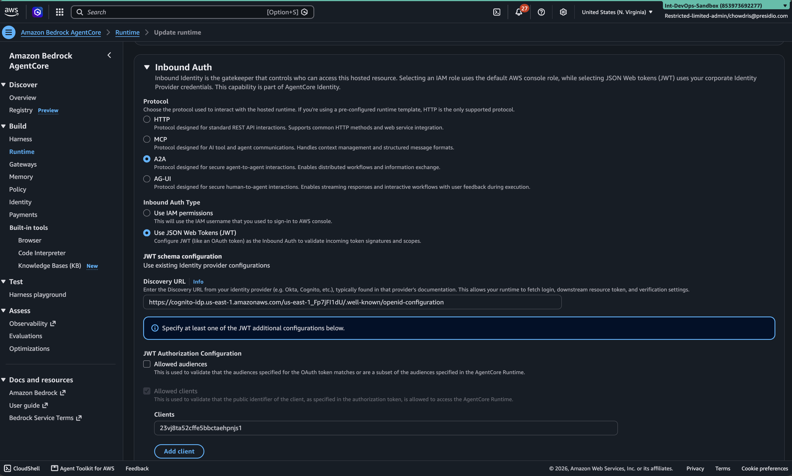
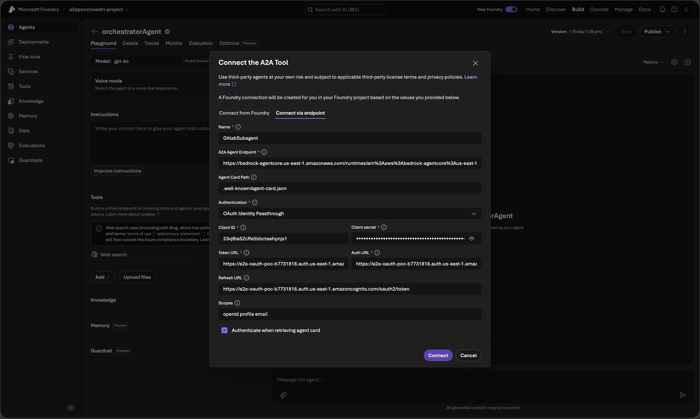
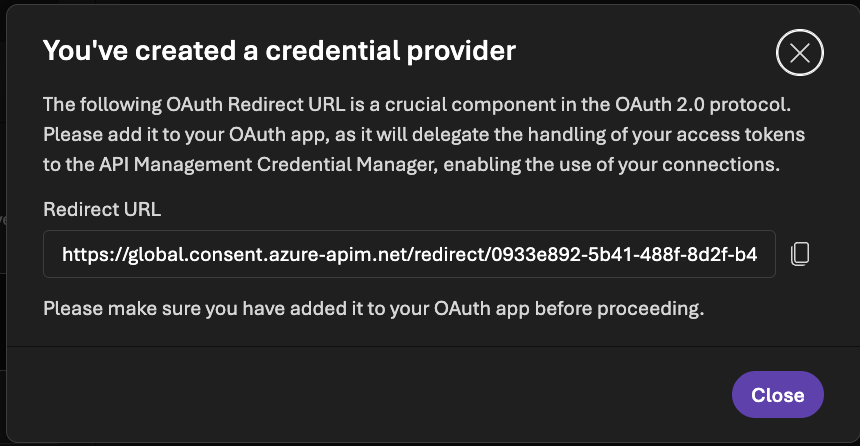
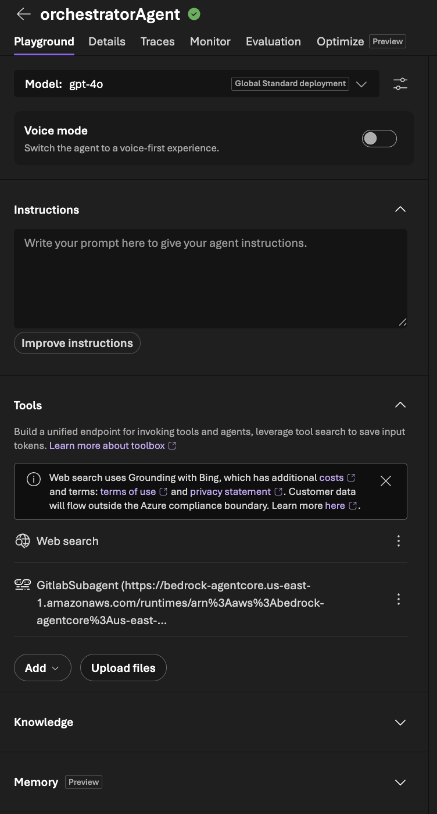
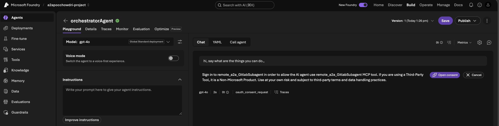
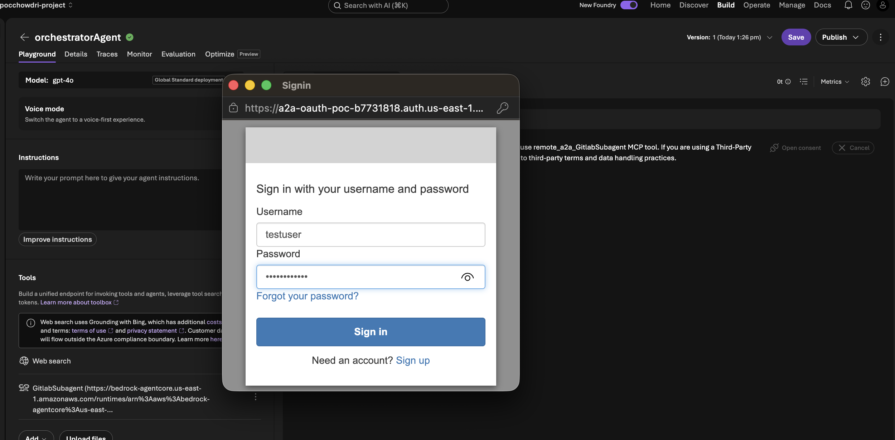
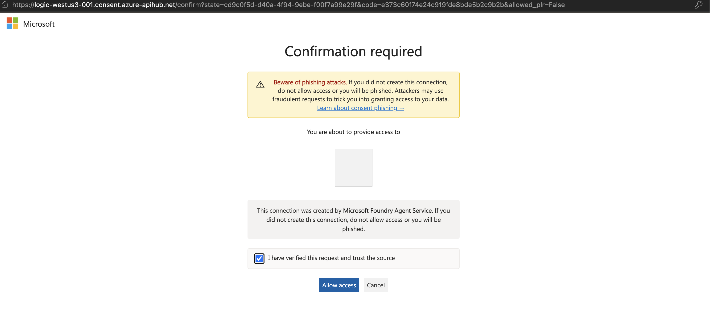
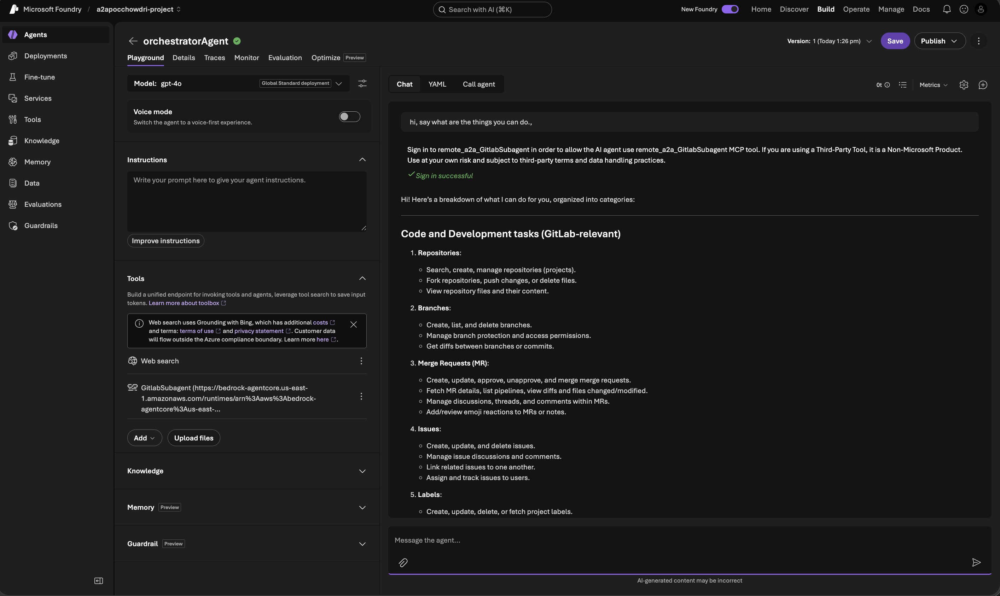

# A Practical Guide to A2A OAuth Passthrough in Azure AI Foundry

**If you've ever wired up an orchestrator agent to call a sub-agent and
found that the sub-agent has no idea who's actually asking, only that
"the orchestrator" is calling, this guide is for you.** It walks through
getting real, per-user identity passthrough working over the A2A
protocol, first between two agents inside Azure AI Foundry, then all the
way out to an agent hosted on a completely different cloud (AWS Bedrock
AgentCore), using a shared identity provider as the trust bridge.

Everything here has been tested and confirmed working end to end. Follow
it in order and you'll avoid the handful of genuinely non-obvious traps
that will otherwise eat your afternoon.

---

## Who This Is For

You're building a multi-agent system on Azure AI Foundry. You have (or
want) an orchestrator that routes questions to specialist sub-agents, and
you need the sub-agent to know the real identity of the person asking,
not just "the orchestrator asked me this," so it can apply real,
per-person permissions.

## The Two Scenarios This Guide Covers

1. **Foundry-to-Foundry**: your orchestrator calls another agent that also
   lives inside Azure AI Foundry.
2. **Foundry-to-anywhere-else**: your orchestrator calls an agent hosted
   outside Foundry entirely, this guide uses AWS Bedrock AgentCore as the
   concrete example, but the same approach applies to any external,
   OAuth-aware A2A endpoint.

These use **different settings**, and using the wrong one for your
scenario is the single most common way to get stuck. Read the next
section before you touch anything.

---

## Part 0: Pick the Right Tool for the Job

Azure AI Foundry's "Connect the A2A Tool" dialog has two tabs. Which one
you need depends entirely on where your target agent lives.

| Your target is... | Use this tab | Auth type |
|---|---|---|
| Another Foundry agent | **Connect from Foundry** | OAuth Identity Passthrough (Managed) |
| Anything outside Foundry | **Connect via endpoint** | OAuth Identity Passthrough (Custom OAuth) |

**Do not use Custom OAuth against a Foundry-hosted target.** It will not
work, no matter how you configure it. A Foundry agent's own endpoint only
ever accepts a token issued by Microsoft's own identity system (Entra
ID). A token from any other identity provider, AWS Cognito, Okta, Auth0,
gets rejected before your permissions or roles even come into play. Save
yourself the trouble and confirm which tab you need before proceeding.

---

## Part 1: Foundry-to-Foundry OAuth Passthrough

### Step 1: Your target can be a Prompt Agent or a Hosted Agent

Foundry offers two kinds of agents:

- **Prompt Agents** live entirely inside Foundry's own managed
  environment, you write instructions and pick tools, Foundry runs the
  rest.
- **Hosted Agents** are your own container, built and deployed by you,
  running your own code.

**Both work as A2A targets for this flow.** Once the role in Step 2 is in
place, "Connect from Foundry" succeeds against either kind. If you hit a
failure fetching the target's "agent card" (a small descriptor file
listing what the agent can do) before granting that role, don't jump to
switching agent types, check the role first, it's the far more common
cause.

The one real reason to prefer a Hosted Agent specifically: it's your own
code, so you can inspect exactly what it receives, which matters when you
get to verifying the setup later in this guide.

### Step 2: Grant the calling user the right role

The person actually using the orchestrator, not the orchestrator's own
service identity, needs the **Foundry Agent Consumer** role on the
sub-agent's project:

```bash
az role assignment create --role "Foundry Agent Consumer" \
  --assignee-object-id "<user-object-id>" --assignee-principal-type User \
  --scope "/subscriptions/<sub>/resourceGroups/<rg>/providers/Microsoft.CognitiveServices/accounts/<account>/projects/<project>"
```

Skip this and you'll get a plain timeout with no useful error message
telling you why.

### Step 3: Create the connection

1. Open your orchestrator agent in the Foundry portal.
2. Go to **Tools** → **Add** → custom tools → connect an A2A tool.
3. Select the **Connect from Foundry** tab.
4. Enter the sub-agent's A2A endpoint:
   ```
   https://<account>.services.ai.azure.com/api/projects/<project>/agents/<agent-name>/endpoint/protocols/a2a
   ```
5. Set Authentication to **OAuth Identity Passthrough**.
6. Save. No client ID, secret, or any OAuth app registration is needed
   for this path.

---

## Part 2: Foundry to an Agent on Another Cloud (AWS Bedrock AgentCore)

This is where **Connect via endpoint** and **Custom OAuth** are the
correct choice, since the target genuinely lives outside Foundry.

### Step 1: Set up a Cognito User Pool as your shared identity provider

If you don't already have one, you can do this either from the AWS
console or with the CLI.

**Using the console:**

1. Go to **Amazon Cognito** → **User pools** → **Create user pool**.
2. Choose the sign-in options you want (email is enough for a test
   setup), then click through the defaults until you reach naming, and
   give the pool a name.
3. Once the pool is created, open it and go to **App integration**.
4. Under **Domain**, create a **Cognito domain** with a unique prefix,
   this is what your sign-in page will be served from.
5. Under **App clients**, click **Create app client**.
   - Choose **Confidential client** (so it gets a client secret).
   - Under **Authentication flows**, check **Authorization code grant**.
   - Under **Allowed callback URLs**, add a placeholder for now,
     `https://ai.azure.com/oauth/callback`, you'll replace this in Step
     4.
   - Under **OAuth scopes**, select `openid`, `profile`, and `email`.
   - Save, then copy the generated **Client ID** and **Client secret**.
6. Go to **Users** → **Create user**. Give it a username and email, set a
   temporary password, and mark the email as already verified so you can
   sign in right away. Set a permanent password for it once created.

**Using the CLI:**

```bash
aws cognito-idp create-user-pool --pool-name "a2a-oauth-poc" --region us-east-1 \
  --auto-verified-attributes email

aws cognito-idp create-user-pool-domain \
  --domain "<your-unique-domain-prefix>" \
  --user-pool-id "<pool-id>" --region us-east-1

aws cognito-idp create-user-pool-client \
  --user-pool-id "<pool-id>" --region us-east-1 \
  --client-name "a2a-foundry-client" \
  --generate-secret \
  --allowed-o-auth-flows code \
  --allowed-o-auth-flows-user-pool-client \
  --allowed-o-auth-scopes openid profile email \
  --supported-identity-providers COGNITO \
  --callback-urls "https://ai.azure.com/oauth/callback"
```

That last callback URL is a placeholder, you'll fix it in Step 4. Create
a real test user too:

```bash
aws cognito-idp admin-create-user \
  --user-pool-id "<pool-id>" --region us-east-1 \
  --username testuser --user-attributes Name=email,Value=testuser@example.com \
  --temporary-password 'TempPass123!' --message-action SUPPRESS

aws cognito-idp admin-set-user-password \
  --user-pool-id "<pool-id>" --region us-east-1 \
  --username testuser --password 'YourRealPassword123!' --permanent
```

### Step 2: Configure your AWS agent to trust Cognito

On the AgentCore console (or via `update-agent-runtime`), set Inbound
Auth Type to **"Use JSON Web Tokens (JWT)"** and fill in:

- **Discovery URL**: `https://cognito-idp.<region>.amazonaws.com/<pool-id>/.well-known/openid-configuration`
- **Allowed clients**: your Cognito App Client ID



Test this once by getting a token with your Cognito credentials and
curling the AgentCore runtime agent's URL directly with it, before
moving on to the Foundry side.

### Step 3: Create the connection in Foundry

1. Open your orchestrator's Tools panel, connect an A2A tool.
2. Select **Connect via endpoint**.
3. Fill in:

| Field | Value |
|---|---|
| A2A Agent Endpoint | your AgentCore invocation URL, with a trailing slash: `.../invocations/` |
| Agent Card Path | `.well-known/agent-card.json`, no leading slash |
| Authentication | OAuth Identity Passthrough |
| Client ID / Client secret | from your Cognito App Client |
| Auth URL | `https://<cognito-domain>.auth.<region>.amazoncognito.com/oauth2/authorize` |
| Token URL / Refresh URL | `https://<cognito-domain>.auth.<region>.amazoncognito.com/oauth2/token` |
| Scopes | `openid profile email` |
| Authenticate when retrieving agent card | checked |



4. Save. Foundry will show you a **redirect URL** it just generated for
   this specific connection. Copy it.



Once the connection is saved, the tool shows up in your orchestrator's
Tools list:



### Step 4: Register the redirect URL with Cognito

Cognito requires an exact match on the callback URL, and Foundry
generates a new one for every connection you create.

**Using the console:** open your app client in Cognito, go to **Edit**
under Hosted UI settings, and add the new redirect URL to the **Allowed
callback URLs** list alongside any already there, then save.

**Using the CLI:** this call replaces the whole callback URL list, so
include every previous redirect URL too, not just the new one:

```bash
aws cognito-idp update-user-pool-client \
  --user-pool-id "<pool-id>" --client-id "<client-id>" --region us-east-1 \
  --explicit-auth-flows ALLOW_USER_PASSWORD_AUTH ALLOW_REFRESH_TOKEN_AUTH ALLOW_USER_SRP_AUTH \
  --allowed-o-auth-flows code --allowed-o-auth-flows-user-pool-client \
  --allowed-o-auth-scopes openid profile email \
  --supported-identity-providers COGNITO \
  --callback-urls "<the-redirect-url-foundry-just-gave-you>"
```

### Step 5: Test it

In your orchestrator's Playground, ask it to use the new tool. It will
tell you it needs to sign in and give you a consent prompt:



Click through, and you'll land on Cognito's own sign-in page, use your
test user's credentials:



After signing in, you'll see a Microsoft consent screen confirming the
connection was created by Microsoft Foundry Agent Service, approve it:



Ask again, and this time it should complete and return a real answer
from your AWS-hosted agent:



**Important:** if you ever change a Custom OAuth connection's settings,
you cannot edit it in place, Foundry will tell you OAuth doesn't support
updating an existing connection. Delete it and create a new one instead,
then repeat Step 4 with the new redirect URL it generates.

---

## Verifying It Works

To confirm the tool was actually called and a genuine response came back
from it, open the **Traces** tab on that message and check that a real
outbound call was made and answered, rather than the orchestrator simply
generating an answer on its own.

To confirm OAuth passthrough specifically, that the sub-agent is seeing
the real signed-in person and not just "the orchestrator," add a small
debug branch to your Hosted Agent so it returns the raw response
including every header it received:

```python
if user_input.strip().lower() == "checkrawheaders":
    return TextResponse(context, request, text=f"raw_headers={raw_headers!r}")
```

Call it through the orchestrator, not directly, and look through the
returned headers for `x-agent-user-id`. That value should match the real
signed-in user's Object ID, not the orchestrator's own service principal.
That's your proof identity passthrough is genuinely working.

---

## References

| # | Source | What it covers |
|---|---|---|
| 1 | [Agent2Agent (A2A) authentication - Microsoft Learn](https://learn.microsoft.com/en-us/azure/foundry/agents/concepts/agent-to-agent-authentication) | A2A authentication concepts and connection types in Foundry |
| 2 | [Connect to an A2A agent endpoint - Microsoft Learn](https://learn.microsoft.com/en-us/azure/foundry/agents/how-to/tools/agent-to-agent) | How to configure the A2A tool and its connections |
| 3 | AWS Bedrock AgentCore documentation (docs.aws.amazon.com/bedrock-agentcore) | A2A protocol support and custom JWT authorizer configuration |
| 4 | `aws-samples/sample-a2a-gateway` | Reference for the `allowedClients`-based Cognito authorization pattern |
